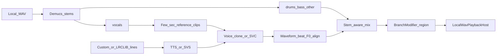

# Loop Lab forward plan

**Branch:** `cursor/lyrics-branch-modifiers-e82b`  
**Scope:** Infinite Jukebox (Loop Lab) — lyrics, Softmax steering, Local-WAV modifiers, waveform-aware splicing, section momentum, and generative vocal/instrument overlays.

This document is the **forward** plan only (no strikethrough history). Earlier shipping notes live in git history and the prior Cursor plan snapshot.

---

## Foundation (already on the feature branch)

These are assumed as given for later phases:

- **Lyrics:** LRCLIB timed LRC + AppData cache; karaoke column; Softmax layers (phrase cuts / same section / block-clean). No lyrics ⇒ empty lyric context ⇒ pure audio Softmax.
- **Local-WAV modifiers:** EQ/drive stacks on locked branches (Ctrl-stretch / Alt-cycle); ignored on Spotify stream.
- **Continuation phase:** Phrase align `(from+1)%N`, region gate on `embeds[i+1]`, Hard bar-phase at nav, seek on next-beat `StartMs`.
- **Exclusions:** Shift+drag ring ranges for dialogue outros; persist on `LoopProfile`.
- **Chrome:** Terminal-black stage, per-track hashed EQ/ring palette, responsive compact lyrics/details/SSM.

**Hard constraint:** Spotify Web Playback = seek/volume only (no PCM). Generative audio and waveform DSP are **Local WAV only**.

```mermaid
flowchart TB
  subgraph shipped [Shipped]
    lyrics[LRCLIB + Softmax lyric layers]
    graph[Enhanced beat graph]
    nav[BeatNavigator Softmax]
    mod[Local WAV BranchModifier]
    excl[Shift exclude ranges]
  end
  subgraph next [Next]
    wave[Phase 4 waveform envelope]
    mom[Phase 5 section momentum]
    gen[Phase 6 stems + voice + remix]
  end
  lyrics --> nav
  graph --> nav
  nav -->|seek| transport[Transport]
  wave --> nav
  mom --> nav
  gen --> mod
  wave --> gen
```

---

## Phase 4 — Waveform / envelope-aware splicing

**Goal:** Use the Local WAV (and existing beat RMS / visual energy) so hops land and leave more cleanly, and quiet/talk outros can be gated without manual paint every time.

| Capability | Approach | Why |
|------------|----------|-----|
| Envelope continuity Softmax | Penalize `\|RMS(j) − RMS(i+1)\|` (and optional loudness slope) at candidate landings | Reduces “volume jumps” at seeks |
| Auto quiet-outro exclude | Detect trailing low-energy / low-onset tails; propose or auto-write `ExcludedRange` | Same store as Shift+paint |
| Novelty as phrase proxy | Foote-style novelty peaks when lyrics missing | Instrumentals still get phrase-ish cuts |
| Local seek polish | Snap seeks near envelope troughs / zero-crossings; optional short equal-power crossfade | Fewer clicks; DJ-grade transitions |

**Integration with later phases:** Phase 6 remix overlays must be **time-aligned to the same beat/waveform grid** (loudness + F0 envelopes) so generated vocals sit in the mix instead of floating on top.

---

## Phase 5 — Section momentum (preserve vs cut)

**Goal:** Explicit Softmax control for *Clubbed to Death*-style behavior — stay in the piano pocket **or** slash to drums/bass.

Scalar `m ∈ [-1, 1]` (preserve ↔ cut):

```text
score = −dist/τ − λ·visits + w_pref·pref + lyricBias + m·MomentumBias(i, j)
```

**MomentumBias (blend):** section Δ, texture/RMS jump, distance from recent landing pocket, optional high-energy “drama” prior when cutting.

**UI:** Soft ↔ Cut slider; **Auto** from:

- Crude: actions/min on the ring  
- Eloquent: EMA of preference wins vs scrub-negatives (Slice 6 labels) as “successful solution” probability — explore (cut) when failing, exploit (preserve) when succeeding  

---

## Phase 6 — Song voice, song sounds, lyrics, and waveform (reworked)

### What “a few lines” actually buys you

Recent **few-shot / zero-shot** local models can clone a **speaking** timbre from seconds of audio (e.g. ~6 s reference for XTTS-v2; OpenVoice zero-shot tone-color conversion). That is **not** the same as “sing these new lyrics in time, in key, over this mix.”

For Loop Lab, Phase 6 splits into three products that share one Local-WAV pipeline:

| Layer | Job | Typical local stack |
|-------|-----|---------------------|
| **A. Song sounds (instrumental)** | Isolate / remix drums, bass, other; layer SFX or generated percussion on a branch | Demucs / Hybrid Transformer Demucs stems; existing `BranchModifier` overlays |
| **B. Song voice (timbre)** | Make new audio sound like *this* singer | Few-shot **TTS clone** (speech) *or* **singing voice conversion** (SVC) on a dry vocal |
| **C. Lyrics (content + timing)** | What is said/sung and **when** it hits the beat grid | LRCLIB/Whisper text; beat/F0/loudness alignment from Phase 4 waveform |



### A — Song sounds (non-vocal)

1. Offline (or first-play) **stem separation** of the cached WAV into vocals / drums / bass / other.  
2. On a supercharged branch: duck or mute original vocals; boost drums/bass; overlay one-shots.  
3. Use **stem-aware crossfades** at hop boundaries (drums/bass enter earlier than vocals) — same idea as modern DJ engines that mix stems independently.

This is the highest-leverage “song sounds” path and does **not** require a voice model.

### B — Song voice (few-shot local models)

**Speech-like overlays (spoken ad-libs, whispered tags):**

- **Coqui XTTS-v2** — clone from ~6 s of reference audio; multilingual; strong quality; CPML restricts commercial use. Community fork continues post-Coqui shutdown.  
- **OpenVoice V2** — zero-shot tone-color conversion; MIT; lighter/faster for personal apps.

**Sung lines (melody + lyrics):**

- Spoken TTS alone will sound wrong on melodic material. Prefer:
  - **Singing voice conversion (SVC):** generate or record a guide vocal → convert timbre with **RVC** / **So-VITS-SVC** (often fine with ~10+ minutes of dry vocal; community reports usable results with less for some voices).  
  - **Singing voice synthesis (SVS):** score/lyrics → mel → vocoder (**DiffSinger**, **VISinger**, data-efficient variants like **MakeSinger**). Heavier; needs pitch/note guidance.

**Practical Loop Lab v1 recommendation:**  
Demucs vocals → short reference clips for **OpenVoice/XTTS** ad-libs **or** RVC on a hummed/MIDI-timed guide for true singing; keep instrumental stems from Demucs.

### C — Lyrics

- **Display / Softmax:** already shipped (LRCLIB).  
- **Authoring:** user-typed lines or AI-suggested alternate lines; map start times to beat indices (existing `LyricBeatMapper`).  
- **Synthesis input:** phonemes/text + target startMs + optional F0 contour extracted from the original vocal stem in that beat span (so the clone follows the song’s melody envelope even when SVC is used).

### Waveform integration (how Phase 4 and 6 meet)

| Waveform signal | Use in Phase 6 |
|-----------------|----------------|
| Beat grid + `StartMs` | Place generated clip starts on the same quantum as jukebox seeks |
| RMS / loudness envelope | Match overlay gain to local mix; Softmax continuity if the remixed region is also a hop landing |
| F0 / pitch track on vocal stem | Guide SVS/SVC so custom lyrics follow the original contour |
| Onset / novelty peaks | Prefer phrase-clean insert points (and auto-exclude speech outros) |
| Zero-crossing + equal-power stem fades | Click-free insert/replace of vocal stem under `BranchModifier` |

**Playback model:** pre-render a **region WAV** (or stem mix) for `fromBeat…toBeat` into the modifier cache; at hop time Local WAV plays the remixed region instead of (or mixed with) the raw capture — still seek-based at the edges, DSP-rich in the middle.

### Ethics / product gates

- Personal/experimental use first; respect model licenses (XTTS CPML vs OpenVoice MIT).  
- No cloud upload of tracks by default — run Python sidecar locally (same pattern as `analyze_track.py`).  
- Clear UI that generated vocals are synthetic.

### Suggested Phase 6 slices

1. **6a — Stems:** Demucs on cached WAV; expose stem mute/solo in BranchModifier.  
2. **6b — Waveform-aligned overlays:** one-shots + equal-power fades on beat grid (no ML voice yet).  
3. **6c — Few-shot speech clone:** OpenVoice/XTTS from Demucs vocal refs → timed ad-lib on branch.  
4. **6d — Singing path:** RVC/So-VITS or DiffSinger-class SVS with F0 from original stem.  

---

## References

### Infinite Jukebox / structure / lyrics (Phases 1–5)

- Paul Lamere, *The Infinite Jukebox* (2012). https://musicmachinery.com/2012/11/12/the-infinite-jukebox/  
- Remixatron. https://github.com/drensin/Remixatron  
- Davies et al., *AutoMashUpper* — IEEE/ACM TASLP 2014. https://doi.org/10.1109/TASLP.2014.2347135  
- Foote, *Automatic audio segmentation using a measure of audio novelty* — ICME 2000. https://doi.org/10.1109/ICME.2000.869637  
- Paulus, Müller, Klapuri, *Audio-based Music Structure Analysis* — ISMIR 2010 survey. https://www.audiolabs-erlangen.de/content/05_fau/professor/00_mueller/03_publications/2010_PaulusMuellerKlapuri_STAR-MusicStructure_ISMIR.pdf  
- Wang / Kan et al., *LyricAlly*. https://www.comp.nus.edu.sg/~kanmy/papers/04432643.pdf  
- *Multimodal Lyrics-Rhythm Matching* — arXiv:2301.02732. https://doi.org/10.48550/arXiv.2301.02732  
- Kim et al., DJ mix subsequence alignment — arXiv:2008.10267. https://ar5iv.labs.arxiv.org/html/2008.10267  

### Waveform / stems / transitions (Phases 4 & 6)

- Défossez et al., *Music Source Separation in the Waveform Domain* (Demucs) — arXiv:1911.13254. https://arxiv.org/pdf/1911.13254  
- Défossez, *Hybrid Spectrogram and Waveform Source Separation* — ISMIR 2021 MSS workshop.  
- Rouard, Massa, Défossez, *Hybrid Transformers for Music Source Separation* (HTDemucs) — ICASSP 2023. https://github.com/facebookresearch/demucs  
- Practical stem-aware / equal-power / beat-aligned transition patterns in open DJ engines (e.g. beat-locked stem crossfades).  

### Few-shot / local voice (Phase 6)

- Casanova et al. / Coqui, **XTTS-v2** — few-second cloning, 17 languages; model card. https://huggingface.co/coqui/XTTS-v2  
- Qin et al., **OpenVoice** — zero-shot cross-lingual voice cloning — arXiv:2312.01479. https://arxiv.org/abs/2312.01479 · https://github.com/myshell-ai/OpenVoice  

### Singing synthesis & conversion (Phase 6)

- Liu et al., **DiffSinger**: Singing Voice Synthesis via Shallow Diffusion Mechanism — AAAI 2022 / arXiv:2105.02446. https://arxiv.org/abs/2105.02446  
- Zhang et al., **VISinger**: Variational Inference with Adversarial Learning for End-to-End Singing Voice Synthesis — ICASSP 2022. https://doi.org/10.1109/ICASSP43922.2022.9747664  
- **MakeSinger** — data-efficient semi-supervised SVS — arXiv:2406.05965. https://arxiv.org/html/2406.05965  
- **So-VITS-SVC** — SoftVC + VITS singing voice conversion (community). https://github.com/svc-develop-team/so-vits-svc  
- **RVC** — Retrieval-based Voice Conversion WebUI (few-minute training claims; FAISS retrieval to reduce timbre leak). https://github.com/RVC-Project/Retrieval-based-Voice-Conversion-WebUI  
- Dong, *Study and Practice of Singing Voice Conversion Based on E-SVS and R-SVC* — JCC 2025 (UVR5 + retrieval SVC pipeline). https://doi.org/10.4236/jcc.2025.139003  

### Softmax / interactive policy (Phase 5)

- Existing Loop Lab Slice 4–6: Softmax(−dist/τ − λ·visits + w_pref·pref); pairwise preference labels + scrub negatives (in-repo).  
- Explore–exploit framing for interactive remix: treat scrub/success EMA as a restless bandit signal over preserve vs cut.

---

## Suggested order of work

1. **Phase 4** — envelope Softmax + auto-exclude + Local crossfade hooks (unblocks Phase 6 alignment).  
2. **Phase 5** — momentum slider + Auto from prefs (pure navigator; no ML sidecar).  
3. **Phase 6a–b** — Demucs stems + waveform-aligned non-vocal overlays on BranchModifier.  
4. **Phase 6c–d** — local few-shot speech clone, then singing SVC/SVS with F0 from vocal stem.
