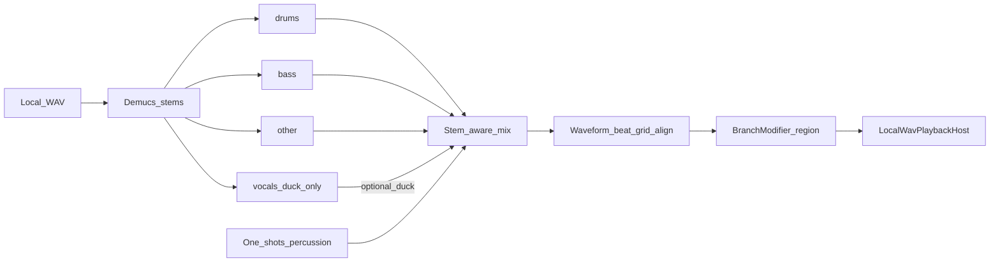

# Infinite Jukebox forward plan

**Branch:** `cursor/lyrics-branch-modifiers-e82b` (merged to `master`)  
**Scope:** Infinite Jukebox — **instrumental** DJ behavior: waveform-aware splicing, section momentum, stem-aware Local-WAV remix, and personal audio enhancement on branches. Lyrics support exists for navigation steering; see [Appendix — Lyrics](#appendix--lyrics).

This document is the **forward** plan only (no strikethrough history). Shipping notes live in [CHANGELOG.md](../CHANGELOG.md).

---

## Foundation (shipped)

Assumed for later phases:

- **Enhanced beat graph + Softmax navigation** — continuation edges, dwell, locks, preference learning, liveliness.
- **Local-WAV modifiers** — EQ/drive stacks on locked branches (Ctrl-stretch / Alt-cycle); ignored on Spotify stream.
- **Continuation phase** — Phrase align `(from+1)%N`, region gate on `embeds[i+1]`, Hard bar-phase at nav, seek on next-beat `StartMs`.
- **Exclusions** — Shift+drag ring ranges for dialogue outros; persist on `LoopProfile`.
- **Chrome** — Terminal-black stage, per-track hashed EQ/ring palette, SSM heatmap, mini player.

**Hard constraint:** Spotify Web Playback = seek/volume only (no PCM). Waveform DSP, stem separation, and branch overlays are **Local WAV only**.

```mermaid
flowchart TB
  subgraph shipped [Shipped]
    graph[Enhanced beat graph]
    nav[BeatNavigator Softmax]
    mod[Local WAV BranchModifier]
    excl[Shift exclude ranges]
  end
  subgraph next [Next — instrumental focus]
    wave[Phase 4 waveform envelope]
    mom[Phase 5 section momentum]
    stems[Phase 6 stems + overlays + mix]
  end
  graph --> nav
  nav -->|seek| transport[Transport]
  wave --> nav
  mom --> nav
  wave --> stems
  stems --> mod
```

---

## Phase 4 — Waveform / envelope-aware splicing

**Goal:** Use the Local WAV (and existing beat RMS / visual energy) so hops land and leave more cleanly, and quiet/talk outros can be gated without manual paint every time.

| Capability | Approach | Why |
|------------|----------|-----|
| Envelope continuity Softmax | Penalize `\|RMS(j) − RMS(i+1)\|` (and optional loudness slope) at candidate landings | Reduces volume jumps at seeks |
| Auto quiet-outro exclude | Detect trailing low-energy / low-onset tails; propose or auto-write `ExcludedRange` | Same store as Shift+paint |
| Novelty as phrase proxy | Foote-style novelty peaks on instrumentals | Phrase-ish cuts without lyrics |
| Local seek polish | Snap seeks near envelope troughs / zero-crossings; optional short equal-power crossfade | Fewer clicks; DJ-grade transitions |

**Integration with Phase 6:** Stem overlays and remixed regions must be **time-aligned to the same beat/waveform grid** (loudness envelopes, onset grid) so instrumental layers sit in the mix instead of floating on top.

---

## Phase 5 — Section momentum (preserve vs cut)

**Goal:** Explicit Softmax control for *Clubbed to Death*-style behavior — stay in the piano pocket **or** slash to drums/bass.

Scalar `m ∈ [-1, 1]` (preserve ↔ cut):

```text
score = −dist/τ − λ·visits + w_pref·pref + lyricBias + m·MomentumBias(i, j)
```

**MomentumBias (blend):** section Δ, texture/RMS jump, distance from recent landing pocket, optional high-energy “drama” prior when cutting.

**UI:** Soft ↔ Cut slider; **Auto** from:

- Crude: actions/min on the ring  
- Eloquent: EMA of preference wins vs scrub-negatives (Slice 6 labels) as “successful solution” probability — explore (cut) when failing, exploit (preserve) when succeeding  

---

## Phase 6 — Instrumental stems, overlays, and personal audio

**Goal:** Make the automated DJ feel like a real mix engine — isolate and rebalance **drums, bass, and other**, layer one-shots and generated percussion, and cache remixed regions on `BranchModifier`. This phase is about **the backing track**, not synthetic vocals.

### What Phase 6 delivers

| Layer | Job | Typical local stack |
|-------|-----|---------------------|
| **Stem separation** | Split cached WAV into drums / bass / other (+ vocal stem for ducking only) | Demucs / HTDemucs |
| **Stem-aware branches** | On a supercharged hop: duck original bed, boost drums/bass, mute noisy stems | Existing `BranchModifier` + stem busses |
| **Overlays** | One-shots, loops, generated percussion on beat grid | Equal-power fades; optional lightweight sample libs |
| **Personal audio** | Per-track EQ/drive presets, enhancement hooks on locked hops | Extend current modifier chain |



### 6a — Stems

1. Offline (or first-play) **stem separation** of the cached WAV.  
2. Expose stem mute/solo/gain in BranchModifier UI.  
3. On supercharged branches: duck or mute the vocal stem; rebalance drums/bass/other independently.

Highest-leverage path for “song sounds” — **no generative voice model required**.

### 6b — Waveform-aligned overlays

1. Place one-shots and short loops on the **beat grid** (same `StartMs` quantum as jukebox seeks).  
2. **Stem-aware crossfades** at hop boundaries (drums/bass enter earlier than pads) — beat-locked stem mixing like modern DJ engines.  
3. Match overlay gain to local RMS envelope (Phase 4 signals).

### 6c — Personal audio enhancement

1. Per-track enhancement presets (EQ curves, drive, bus compression) saved with lock presets.  
2. Pre-render a **region WAV** (or stem mix) for `fromBeat…toBeat` into the modifier cache.  
3. At hop time Local WAV plays the remixed region mixed with (or instead of) the raw capture — seek-based at edges, DSP-rich in the middle.

### Waveform integration (Phase 4 + 6)

| Waveform signal | Use |
|-----------------|-----|
| Beat grid + `StartMs` | Quantize overlay starts and stem crossfades |
| RMS / loudness envelope | Match stem/overlay gain; Softmax continuity at landings |
| Onset / novelty peaks | Phrase-clean insert points; auto-exclude speech outros |
| Zero-crossing + equal-power fades | Click-free stem swaps under BranchModifier |

### Ethics / product gates

- Personal/experimental use first; respect model licenses for bundled separation models.  
- No cloud upload of tracks by default — run Python sidecar locally (same pattern as `analyze_track.py`).

### Suggested Phase 6 slices

1. **6a** — Demucs on cached WAV; stem mute/solo in BranchModifier.  
2. **6b** — Waveform-aligned one-shots + equal-power stem fades on beat grid.  
3. **6c** — Personal enhancement presets + pre-rendered remixed regions per lock.

---

## References

### Infinite Jukebox / structure (Phases 4–5)

- Paul Lamere, *The Infinite Jukebox* (2012). https://musicmachinery.com/2012/11/12/the-infinite-jukebox/  
- Remixatron. https://github.com/drensin/Remixatron  
- Davies et al., *AutoMashUpper* — IEEE/ACM TASLP 2014. https://doi.org/10.1109/TASLP.2014.2347135  
- Foote, *Automatic audio segmentation using a measure of audio novelty* — ICME 2000. https://doi.org/10.1109/ICME.2000.869637  
- Paulus, Müller, Klapuri, *Audio-based Music Structure Analysis* — ISMIR 2010 survey. https://www.audiolabs-erlangen.de/content/05_fau/professor/00_mueller/03_publications/2010_PaulusMuellerKlapuri_STAR-MusicStructure_ISMIR.pdf  
- Kim et al., DJ mix subsequence alignment — arXiv:2008.10267. https://ar5iv.labs.arxiv.org/html/2008.10267  

### Waveform / stems / transitions (Phases 4 & 6)

- Défossez et al., *Music Source Separation in the Waveform Domain* (Demucs) — arXiv:1911.13254. https://arxiv.org/pdf/1911.13254  
- Défossez, *Hybrid Spectrogram and Waveform Source Separation* — ISMIR 2021 MSS workshop.  
- Rouard, Massa, Défossez, *Hybrid Transformers for Music Source Separation* (HTDemucs) — ICASSP 2023. https://github.com/facebookresearch/demucs  
- Beat-locked stem crossfades in open DJ engines (equal-power / stem-aware transition patterns).

### Softmax / interactive policy (Phase 5)

- In-repo Slice 4–6: Softmax(−dist/τ − λ·visits + w_pref·pref); pairwise preference labels + scrub negatives.  
- Explore–exploit framing: scrub/success EMA as restless bandit signal over preserve vs cut.

---

## Suggested order of work

1. **Phase 4** — envelope Softmax + auto-exclude + Local crossfade hooks (unblocks Phase 6 alignment).  
2. **Phase 5** — momentum slider + Auto from prefs (pure navigator; no ML sidecar).  
3. **Phase 6a–c** — Demucs stems, waveform-aligned instrumental overlays, personal enhancement presets on BranchModifier.

---

## Appendix — Lyrics

Lyrics are **not** the focus of this forward plan, but they are already shipped and will likely stay useful for navigation and timing.

### Shipped (steering only)

- LRCLIB timed LRC + AppData cache; karaoke column on stage.  
- Softmax **lyric-flow** layers (phrase cuts / same section / block-clean) — bonuses only; they do not remove graph edges. See [`docs/infinite-jukebox-lyric-flow.md`](infinite-jukebox-lyric-flow.md).  
- No lyrics ⇒ empty lyric context ⇒ pure audio Softmax.

### Future support role (not synthesis)

| Use | Notes |
|-----|--------|
| Hop steering | Phrase boundaries, same-section preference, block-clean landings |
| Beat mapping | `LyricBeatMapper` — align line starts to beat indices for UI and diagnostics |
| Timing hints for instrumental work | Phrase boundaries can inform Phase 4 novelty / Phase 5 momentum when waveform alone is ambiguous |

### Out of scope for this plan

- **Lyric synthesis**, **voice cloning**, **SVC/SVS**, and **custom sung lines** are not planned milestones. If explored later, they would be a separate experimental track — instrumental stem remix remains the product goal.

### Lyrics references

- Wang / Kan et al., *LyricAlly*. https://www.comp.nus.edu.sg/~kanmy/papers/04432643.pdf  
- *Multimodal Lyrics-Rhythm Matching* — arXiv:2301.02732. https://doi.org/10.48550/arXiv.2301.02732  
